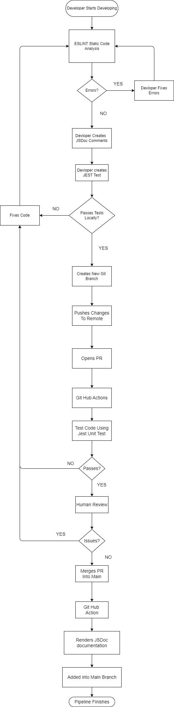

# CICD Pipeline

## Introduction

Welcome to the initial phase of ShellDiver's CI/CD Pipeline, where we have established a foundational framework aimed at enhancing the quality and reliability of our software development process. At this stage, our pipeline incorporates a series of automated and manual checks designed to streamline development workflows and ensure that our codebase remains clean and efficient. Currently, we have successfully integrated ESLint for stringent linting and code-style enforcement. This will help maintain a consistent coding standard across the project. Pull requests are mandatory and instilled in all contributions to the main branch. This fosters a collaborative review culture and minimizes integration issues. We have also applied Jest for unit testing, as we have learned in lab 5, to catch bugs early in the development cycle. Additionally, our pipeline automatically generates documentation through JSDocs to keep all project stakeholders aligned. This first phase serves as the groundwork for more sophisticated tools and processes we plan to implement in Phase 2. We plan to incorporate third-party code quality via tools, such as Codeclimate or Codacy (although we don't like either.). After lab 6, we will incorporate e2e, end-to-end, and pixel testing after lab6.

## Phase 1 CI/CD Pipeline walkthrough

- First, the developer will begin developing.
- Next, it will go through ESLINT Static Code analysis
- Then it will check for errors
  - If there are errors, the developer will fix the errors and go back to Step 2
  - Otherwise, the developer will create JSDoc comments
- After the Developer creates JSDoc Comments, the developer will create JEST Test
- We ask, does it pass the test locally
  - If not, fix the code and go back to step 2
  - If it passes the test locally, then create a new git branch
- After the new git branch, push the changes to remote
- Open a Pull Request
- Go through GitHub actions
- Test code using Jest Unit Test
  - If the code does NOT pass, fix the code, and go back to step 2
  - If the code does, pass through human review
- A team member will review the code
  - If there are issues, fix the code and go back to step 2
  - If there are no issues, Merge the Pull Request to the Main Branch
- After the merge, go through GitHub actions
- Which renders JSDoc documentation
- Add into Main Branch
- Pipeline Finish

This structured approach, [reference](phase1.drawio.png), not only enhances or development practices but also ensures that our application remains robust and maintainable. As we look forward to Phase 2, our focus will shift towards integrating additional tools for code quality assessments and expanding our testing capabilities to include e2e, end-to-end, and pixel tests after the upcoming lab 6. This progression will continue to solidify our commitment to delivering high-quality software efficiently and effectively.
