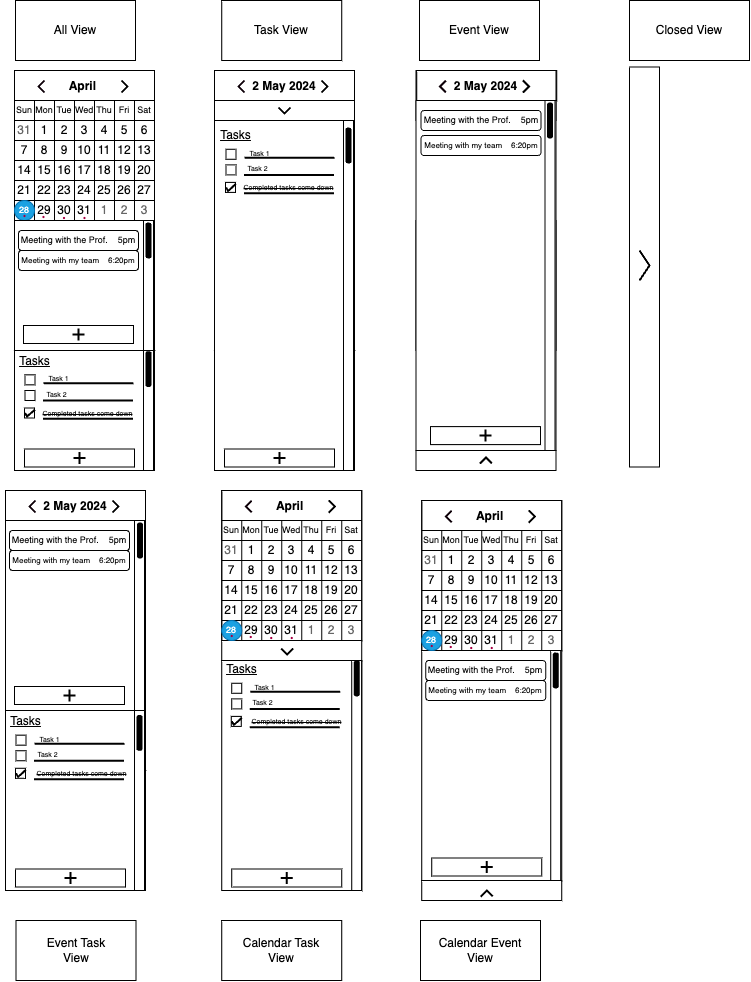

# Draft #2 Proposal

# Frame:

---

## Side Bar:

- Will show the user
    - Calendar - Top third (default size)
    - Event List - Middle Third (default size)
    - Task List - Bottom Third (default size)
- If right bar is dragged left
    - less than calendar size
        - collapse side bar
        - show arrow pointing left
            - if clicked then bar is resized to be width of calendar
- Calendar:
    - Will ALWAYS be in a fixed size, no resized
    - If right bar of side bar is resized calendar will take up top left mode position
    - No current agreement on what will show to the right of the calendar (dead space)
    - If bottom bar of calendar is dragged up
        - calendar will collapse instantly
- Event List
    - Can be resized
    - Will take up the most width possible
    - If bottom of event is dragged up
        - all the way will close event list
        - will decrease height if not all the way
        - box with down arrow will show up
            - IF box selected revert event list to default size
    - If bottom of event list is dragged down
        - height will change
- Task List:
    - Can be resized
    - will take up most width possible
    - If top of task list dragged down
        - height is resized
        - if all the way then collapse
        - box with up arrow will show up
            - if box is clicked revert task list to default size

## Journal Entry:

- Will Show
    - options bar
    - journal entry list
    - details bar
- If left or right bar is moved
    - size will be less width or more width accordantly
- Options bar
    - cannot be resized in height, same size always
- journal entry list
    - can be shrunk in height up to calendar height
- details bar
    - can be collapsed down
    - must right click somewhere free on journal entry selection to have option to bring back

## Canvas:

- Will Show
    - options bar
    - text box
    - details bar
- If left or right bar is moved
    - size will be less width or more width accordantly
- Options bar
    - cannot be resized in height, same size always
- text box
    - can be shrunk in height up to calendar height
- details bar
    - can be collapsed down
    - must right click somewhere free on journal entry selection to have option to bring back

# Side Bar:

---

## Calendar:

- Static size, will either be fully shown or hidden so only current day in the format < Month Day, Year > is shown
- The user will see a square calendar displaying by default the current month and year          (see below)
- By default, the current day will be selected with a circle
- If user selects different day
    - current day will be uncircled
    - new selected day will be circled
    - rest of journal will show entries for selected day

**(image below)**

**\image**

- If user clicks left or right navigation arrows enclosing the month
    - will go to previous or next month, respectively
    - a special return arrow ( ⤺ ) will always appear in the top left corner next to the month bar:                      ⤺ < Current Month > when either navigation arrow is clicked at least once (i.e. the user went back at least one month or went forward at least one month)
        
        If user clicks this special arrow
        
        - returns to view showing current month and year, and day selection returns to current day
        - the special arrow disappears
        - you can hover on top of the button and text saying “Back to today” will be displayed
    - user can can keep clicking the left and right navigation arrows as many times as they like to go backward or forward in months
- If user clicks month
    - enters month view, showing current year in top bar and all the months underneath in a 3x4 grid (3 across, 4 down)          **(see image below)**
        
        
        In the top left corner there will always be the same special return arrow ( ⤺ ) next to the year bar: ⤺ < Year >
        
    - If user clicks the special return arrow ( ⤺ )
        - returns to grid containing months and the current year in top bar
    - If user clicks year, it will enter year view, which shows current year in the middle of a 3x3 grid and navigation (see image below). The navigation bar will only show a left and right arrow < > to show earlier or later years, respectively
    - If user clicks the left arrow
        - every year in grid will be decreased by 9
    - If user clicks the left arrow
        - every year in grid will be increased by 9
        
        In the top left corner there will always be the same special return arrow ( ⤺ ) next to the navigation bar: ⤺ <  >
        
    - If user clicks the special return arrow ( ⤺ )
        - return to grid containing current year in center of 3x3 grid

## Events:

- When the user opens the website for the first time in the day the events list will reflect the events of the current day. (this will be empty if no events were added to the current day in previous days)
    - At the bottom of the events section there will be a plus button
- User clicks the plus button
    - user will be prompted with a popup to enter information for a task, this menu includes cancel and confirm buttons
        - Includes event title, start date and time, end date and time, info
        - If the user clicks the cancel button - the popup will be removed and the user will return to the original page, the event list will remain unchanged
        - if the user clicks the confirm button - the popup will be removed and the user will return to the original page, the event will be added to the list based on start time.
            - If the event lasts multiple days it will be entered into multiple days events list and the time stamp will say (all day)
- How the user can interact with events within the events list
    - The user can right click on a event this will cause a right click options menu to drop down and there will be a [view event] and [delete event] option
        - When the user clicks view event - The canvas will reflect the selected event
        - When the user clicks delete event - The task will be removed from the event list
- In the case that there are more events then fit in the events space vertically, there will be a scrollbar allowing the user to scroll through their events
- If a title of a event is to long to fit in one line a “…” will appear at the end of the title
    - If the event list is expanded horizontally, more of the title will show.
    - The “…” will remain unless there is enough space horizontally for the title of a event to fit in one line

## Task List:

- When the user opens the website for the first time in the day the task list will be empty (because the user has not added any tasks yet)
    - The user will see an empty section titled “Tasks” will a plus button on the bottom
- User clicks the plus button
    - user will be prompted with a popup to enter information for a task
        - User will need to enter a task title and task information
    - The user can then confirm their task - the task will be added to the top of the task list
    The user can also cancel their task input - They will be returned to the original task screen
- Once a task has been added to the Task list, the user will be able to interact with said task
    - The user can click the box next to the task - This will cross the task out and move it to the bottom of the list
    - The user can click on the task title (to the right of the box that can be checked) - This will allow the user to edit the Title of the task
    - The user can right click on the task - this will cause a right click options menu to drop down and their will be a [view task] and [delete task] option
        - When the user clicks view task - The canvas will reflect the selected task
        - When the user clicks delete task - The task will be removed from the task list
    - The user can hover on a task
        - This will show the user a “dragging” option (ex. “ ⋮ “) where the user can drag the task above or below other tasks to reorder the task list to their liking
- In the case that there are more tasks then fit in the tasks space vertically, there will be a scrollbar allowing the user to scroll through their tasks
- If a title of a task is to long to fit in one line a “…” will appear at the end of the title
    - If the task list is expanded horizontally, more of the title will show.
    - The “…” will remain unless there is enough space horizontally for the title of a task to fit in one line

# Journal Entry Selection:

---

## Option Bar:

- Will Show the user
    - search bar
    - filter option
    - new draft option
- If search bar is clicked
    - user can type in keywords to search in journal
    - journal entry list will reflect journal entries that match query
    - details bar will reflect amount of entries shown
- If Filter options is clicked
    - Drop-Down of filter options (tags for now) will show
    - User can select different tags to filter
    - User can click clear button to clear all filters
    - details bar will reflect amount of entries shown
- If User clicks new draft option
    - new blank journal entry with time will show up in the journal entry list
    - canvas will reflect the new draft that is opened and will be a blank canvas on edit mode
    - details bar will reflect amount of entries shown

## Journal Entry List:

- Will Show the user
    - journal entries
- If User selects journal entry
    - Canvas will reflect journal entry selection
    - Canvas will be brought up in “view mode”
    - Journal entry will be grayed out to reflect selection

## Details Bar:

- Will show the user
    - How many entries exist in the journal entry list

# Canvas [View Mode]:

---

## Options Bar:

- Will show the user
    - delete button, top left
    - canvas mode, center (view mode here)
    - Edit mode button, top right
    - special star tag button, left of edit mode button

- If the user selects the delete button
    - Pop up of confirmation of delete
    - If user confirms journal entry will be deleted
- If the user selects the star tag
    - Star tag will be added to journal entry
    - start will change color [ ]
    - star will appear in the journal entry in the journal entry list
- If the user selects the edit button
    - Canvas will change to edit mode

## Text Box [View Mode]:

- will show the user
    - tags, top [under options bar]
        - Assigned tags, left most filled
        - tag option
    - Text
- If the user selects the tag option
    - pop up of tag selection opens
    - the user can select and deselect tags
    - the user can also add new tags
        - will let the user name the new tag
- If the user double clicks on the text
    - canvas will turn into edit mode

## Details Bar:

- will show the user the  amount of words in the document

# Canvas [Edit Mode]:

---

## Options Bar:

- Will show the user
    - cancel button, top left
    - canvas mode, center (edit mode here)
    - Confirmation button, top right
    - special star tag button, left of edit mode button

- If the user selects the cancel button
    - The users edits will be cancelled
    - The canvas will return to view mode of the journal entry before edits (original entry)
- If the user selects the star tag
    - Star tag will be added to journal entry
    - start will change color [ ]
    - star will appear in the journal entry in the journal entry list
- If the user selects the confirmation button
    - The canvas will return to view mode
    - The edits made to the entry will remain and will be reflected in view mode as well as in the journal entry list

## Text Box [Edit Mode]:

- will show the user
    - tags, top [under options bar]
        - Assigned tags, left most filled
        - tag option
    - Text box
        - Document toolbar
- If the user selects the tag option
    - pop up of tag selection opens
    - the user can select and deselect tags
    - the user can also add new tags
- If user selects text box
    - user can edit text box
    - user can use document toolbar to edit text box

## Details Bar:

- Will show the user the amount of words
